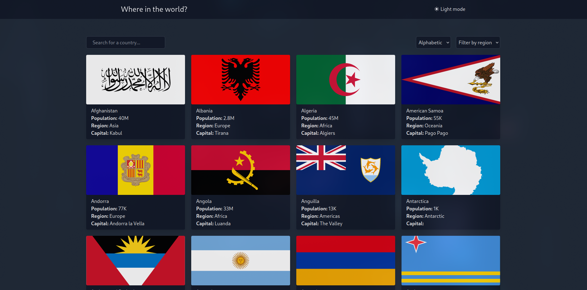

<h1 align="center">:world_map: Countries</h1>

<p align="center">
  <i align="center">A app to see infos about the countries</i>
  
</p>

## Project Status


## Description

A simple Next.js application that provides a comprehensive overview of countries around the globe. Explore detailed information about each country, including population, area, capital, currency, and more. 

##  Tools

[](https://nextjs.org/)
[](https://www.typescriptlang.org/)
[](https://tailwindcss.com/)

##  Running the project

1. Clone the repository and install dependencies:

```shell
git clone https://github.com/vsantos1711/countries.git && cd countries && 
pnpm install
```
2. Run the setup script, which takes care of installing dependencies, building packages and setting up the workspace:

```shell
pnpm run dev
```
## Contributors

<a href="https://github.com/vsantos1711/countries/graphs/contributors">
  
</a>
